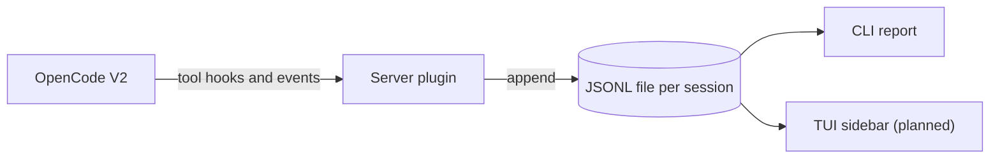

<div align="center">

# 👣 opencode-footprint

**See what your OpenCode agent actually did.**<br>
Files touched, commands run, network access: in seconds. No raw logs, no Docker.

[](https://github.com/Marcen1603/opencode-footprint/actions/workflows/ci.yml)
[](LICENSE)
[](https://opencode.ai)

</div>

> [!NOTE]
> Early development (v0). Not on npm yet, see [Try it locally](#try-it-locally).

## Why

Agents edit files, run shell commands and reach the network while you look elsewhere. Existing tools show raw event logs or token costs. **opencode-footprint answers one question: what did the agent do in this session?** A readable summary, stored locally, no sandbox needed.

## What it records

| | What | How reliable |
|---|---|---|
| 📄 **Files** | read, created, edited, deleted | `hook` |
| ⌨️ **Commands** | shell commands the agent ran | `hook` |
| 🌐 **Network** | hosts and registries a command likely contacts | `inferred` |
| 🧰 **Tools** | name of every other tool used, e.g. an MCP tool | `hook` |
| 🕐 **Sessions** | started, idle | `hook` |

Every entry carries a confidence level: **`hook`** reported by OpenCode · **`inferred`** derived from a command, so a hint and not proof · **`observed`** seen independently of OpenCode (reserved for a future wrapper mode).

## Quick start

```jsonc
// opencode.json
{ "plugins": ["opencode-footprint"] }
```

After a session:

```sh
npx opencode-footprint sessions            # list sessions of this project
npx opencode-footprint report [session-id] # summary, defaults to the latest
```

Needs **OpenCode V2** (developed against plugin SDK 2.0.26). V1 is not supported. Footprints are written to `.opencode/footprint/`, so add that folder to your `.gitignore`.

## How it works



One package, three entry points:

| Entry point | Role |
|---|---|
| `opencode-footprint` | Server plugin, writes the footprint |
| `opencode-footprint/tui` | TUI plugin, live sidebar (planned) |
| `opencode-footprint` (CLI) | Reports for past sessions |

## Privacy

- Everything stays on your machine, nothing is sent anywhere.
- Other tools are recorded by **name only**, never their input.
- Credentials in stored commands (URL passwords, bearer tokens, `--token`) are masked on a best-effort basis.

## Roadmap

- [x] Event schema and JSONL store
- [x] Capture files, commands, network hints and tool names
- [ ] Readable report instead of counters
- [ ] Exit codes of commands
- [ ] Live TUI sidebar
- [ ] Optional wrapper mode that observes OpenCode independently

## Try it locally

<details>
<summary>Run it against a small local model with Ollama, no paid model needed</summary>

<br>

**1. Install OpenCode V2.** V1 and V2 share the `opencode` command, so remove V1 first:

```sh
npm uninstall -g opencode-ai
npm install -g @opencode/cli@2.0.26
opencode --version   # should print 2.x
```

Avoid `ollama launch opencode`, it may install V1 again.

**2. Get a local model.** Pick one with tool support (see the "tools" tag in the [Ollama library](https://ollama.com/library)):

```sh
ollama pull qwen3:4b
```

Set a context length of 16k-32k in the Ollama settings. To keep models off your system drive, set the user environment variable `OLLAMA_MODELS` to another folder and restart Ollama. Small models call tools less reliably: if the agent does nothing, try another model before suspecting the plugin.

**3. Build and load the plugin.**

```sh
bun install && bun run build
```

```jsonc
// opencode.json of the project you test in
{ "plugins": ["file:///path/to/opencode-footprint"] }
```

Start `opencode` there and give the agent a small task, for example: *create hello.txt and run `curl https://example.com`*.

**4. Look at the result.**

```sh
npx opencode-footprint report
```

Nothing recorded? Start OpenCode with `OPENCODE_FOOTPRINT_DEBUG=1` (PowerShell: `$env:OPENCODE_FOOTPRINT_DEBUG=1`). The plugin then also writes the raw hook payloads to `.opencode/footprint/debug.jsonl`.

</details>

## Development

<details>
<summary>Setup, checks and project layout</summary>

<br>

Requires [Bun](https://bun.sh) (version pinned via `packageManager`).

```sh
bun install
bun run typecheck
bun run lint        # bun run format to auto-fix
bun test
bun run build
```

```
src/
  schema.ts   shared event format, the contract between writers and readers
  store.ts    file locations, append and read of session JSONL
  extract.ts  turns OpenCode tool calls into footprint events
  network.ts  best-effort network detection and credential masking
  report.ts   aggregation for CLI and TUI
  plugin.ts   server plugin (writer)
  tui.ts      TUI plugin (reader)
  cli.ts      CLI (reader)
```

</details>

## License

[MIT](LICENSE)
